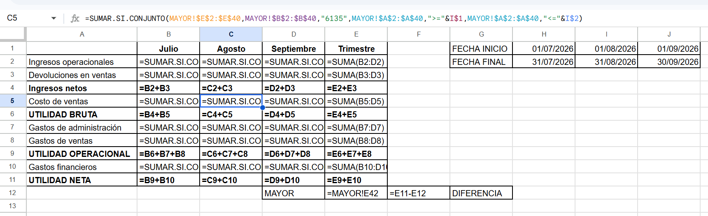
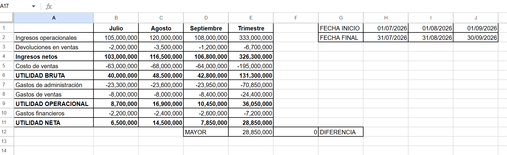

# Estado de Resultados trimestral construido desde el libro mayor

Construcción de un P&L mensual y trimestral a partir de los asientos de un libro mayor, usando agregación condicional parametrizada en Google Sheets.

---

## Problema

Recibo un libro mayor de 39 asientos correspondientes al tercer trimestre de 2026 (julio–septiembre) de una empresa comercializadora, con codificación PUC colombiano. Los asientos vienen sin clasificar por línea de estado financiero y mezclados con movimientos que no corresponden al Estado de Resultados.

El encargo: **construir el P&L de los tres meses y del trimestre consolidado**, de forma que el reporte pueda recalcularse al cambiar el periodo sin reescribir fórmulas.

## Enfoque

**1. Estructura parametrizada.** El reporte se construyó como una matriz donde:

- Una columna auxiliar guarda el **código PUC** de cada línea del P&L
- Dos filas de encabezado guardan la **fecha inicial y final** de cada mes
- Ningún criterio está escrito dentro de las fórmulas

**2. Una sola fórmula para toda la parrilla.** Usando `SUMIFS` con tres criterios —cuenta, fecha desde y fecha hasta— y **referencias mixtas**, una única fórmula cubre las diez líneas por los tres meses:

```
=SUMIFS(MAYOR!$E$2:$E$40, MAYOR!$B$2:$B$40, $B5,
        MAYOR!$A$2:$A$40, ">="&C$3,
        MAYOR!$A$2:$A$40, "<="&C$4)
```

- `MAYOR!$E$2:$E$40` — absoluta: el origen de datos no se desplaza
- `$B5` — columna fija: al avanzar de mes sigue leyendo el código de cuenta
- `C$3` — fila fija: al bajar de línea sigue leyendo la fecha del mes



**3. Subtotales calculados, no consultados.** Las líneas de utilidad bruta, operacional y neta se obtienen sumando las líneas superiores, no volviendo a consultar el mayor. Así el reporte no puede contradecirse a sí mismo.

**4. Validación de cuadre.** El total de la columna de valores del mayor se contrasta contra la utilidad neta del trimestre, y toda diferencia debe quedar explicada.

## Resultado



**Estado de Resultados · Tercer trimestre 2026** (pesos colombianos)

| | Julio | Agosto | Septiembre | Trimestre |
|---|---:|---:|---:|---:|
| Ingresos operacionales | 105.000.000 | 120.000.000 | 108.000.000 | 333.000.000 |
| Devoluciones en ventas | (2.000.000) | (3.500.000) | (1.200.000) | (6.700.000) |
| **Ingresos netos** | **103.000.000** | **116.500.000** | **106.800.000** | **326.300.000** |
| Costo de ventas | (63.000.000) | (68.000.000) | (64.000.000) | (195.000.000) |
| **Utilidad bruta** | **40.000.000** | **48.500.000** | **42.800.000** | **131.300.000** |
| Gastos de administración | (23.300.000) | (23.600.000) | (23.950.000) | (70.850.000) |
| Gastos de ventas | (8.000.000) | (8.000.000) | (8.400.000) | (24.400.000) |
| **Utilidad operacional** | **8.700.000** | **16.900.000** | **10.450.000** | **36.050.000** |
| Gastos financieros | (2.200.000) | (2.400.000) | (2.600.000) | (7.200.000) |
| **Utilidad neta** | **6.500.000** | **14.500.000** | **7.850.000** | **28.850.000** |

Margen bruto del trimestre: **40,2%** · Margen neto: **8,8%**

### Conciliación del cuadre

La suma de la columna de valores del mayor completo arroja **(6.150.000)**, frente a una utilidad neta de **28.850.000**. Diferencia: **35.000.000**, explicada íntegramente por dos asientos que **no son cuentas de resultado**:

| Fecha | Cuenta | Concepto | Valor |
|---|---|---|---:|
| 12/08/2026 | `1524` | Equipo de oficina | (15.000.000) |
| 25/09/2026 | `2205` | Proveedores nacionales | (20.000.000) |

Ninguno de los dos afecta el P&L:

- **La compra de equipo** es la adquisición de un activo. Sale efectivo, pero el gasto se reconoce gradualmente vía depreciación —la cuenta `5160`, que sí está incluida en el reporte.
- **El pago a proveedores** reduce un pasivo. El gasto se reconoció al recibir la mercancía, no al pagarla.

Ambos movimientos consumen caja sin tocar la utilidad, que es precisamente la distinción entre el Estado de Resultados y el Estado de Flujo de Efectivo.

## Aprendizaje

**Los parámetros no viven dentro de las fórmulas.** Cuentas y fechas se mantienen en celdas visibles. Cambiar el trimestre analizado es editar seis celdas, no reescribir treinta fórmulas.

**Las referencias mixtas son lo que convierte una fórmula en un reporte.** Sin ellas, una parrilla de 10 líneas × 3 meses son 30 fórmulas distintas que hay que mantener una por una.

**Un descuadre mal medido manda a investigar donde no hay nada.** En la primera conciliación resté dos cifras de signo contrario como si ambas fueran positivas y obtuve una diferencia que no podía explicarse con ningún asiento. Verificar la magnitud del descuadre antes de buscar su origen ahorra el tiempo completo de la búsqueda.

**Un total correcto no valida una fórmula.** Varias veces durante la construcción obtuve resultados creíbles con criterios mal planteados: comodines aplicados sobre columnas numéricas devuelven cero sin error, y dos criterios de fecha con el mismo operador colapsan el rango sin advertirlo. La única validación real es contrastar contra un caso cuyo resultado se conoce de antemano.

## Archivos

| Archivo | Contenido |
|---|---|
| `libro-mayor-trimestre.csv` | Datos de origen: 39 asientos, jul–sep 2026 |
| `pyg-trimestral.xlsx` | Modelo con las pestañas `MAYOR` y `PYG` |
| `img/` | Capturas del reporte y de la vista de fórmulas |

## Herramientas

Google Sheets · `SUMIFS` · referencias mixtas · criterios parametrizados con concatenación
