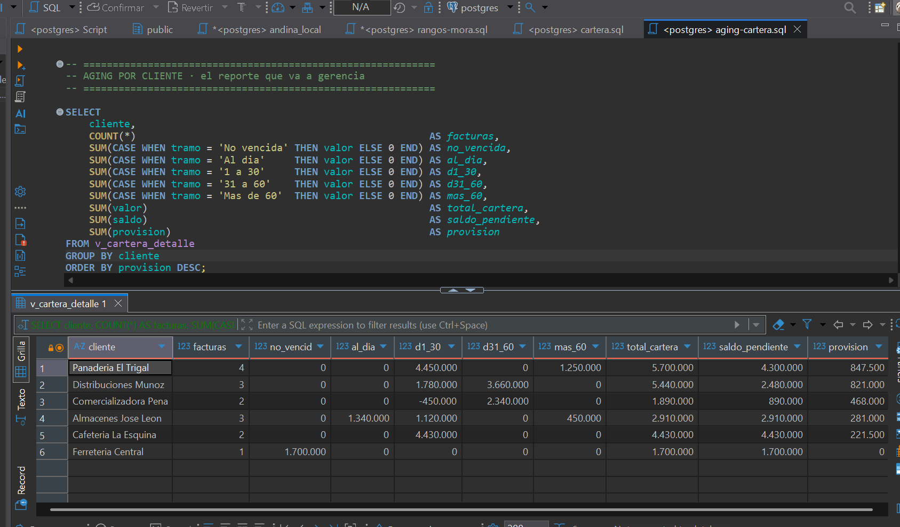
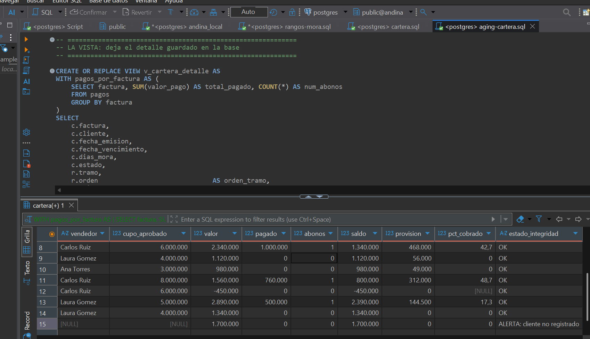

# Aging de cartera en SQL

Modelo de análisis de cuentas por cobrar construido sobre PostgreSQL: clasificación por antigüedad, cálculo de provisión con política parametrizada, estado de cuenta por factura y controles de calidad de datos.

---

## Problema

Una comercializadora tiene su cartera repartida en tres fuentes que nadie cruza: las facturas emitidas, el maestro de clientes del área comercial, y los abonos registrados por tesorería.

La consecuencia práctica es que **nadie puede responder preguntas básicas sin armar un Excel a mano cada mes**: cuánto se debe por cliente, cuánto de eso está en riesgo, y cuánto hay que provisionar.

El encargo: construir ese análisis directamente sobre la base de datos, de forma que se pueda volver a ejecutar en cada cierre sin rehacer nada.

## Modelo de datos

| Tabla | Contenido | Grano |
|---|---|---|
| `cartera` | 15 facturas al corte | Una fila por factura |
| `clientes` | Maestro comercial: NIT, ciudad, sector, cupo, vendedor | Una fila por cliente |
| `pagos` | 10 abonos recibidos | Una fila por abono |
| `rangos_mora` | Política de tramos y provisión | Una fila por tramo |

El cruce entre `cartera` y `pagos` es **uno a varios**: una factura puede tener varios abonos. Esa relación es el origen del riesgo principal del modelo, explicado más abajo.

## Enfoque

**La política no vive en las consultas.** Los tramos de antigüedad y sus porcentajes de provisión están en la tabla `rangos_mora`. Cambiar la política de cartera es editar cinco filas, no reescribir las consultas.

La asignación de tramo se hace con un `JOIN` por rango:

```sql
LEFT JOIN rangos_mora r
    ON c.dias_mora BETWEEN r.dia_desde AND r.dia_hasta
```

Es el equivalente a una búsqueda aproximada en hoja de cálculo, con una ventaja: no exige que la tabla de rangos esté ordenada.

**Los abonos se agregan antes de cruzar.** Una CTE colapsa los pagos a una fila por factura. Sin ese paso, una factura con tres abonos aparecería tres veces y su valor se sumaría tres veces.

**Toda la lógica se concentra en una vista.** `v_cartera_detalle` queda publicada en la base: cualquier persona o herramienta puede consultarla sin conocer los JOIN ni las reglas de negocio. Los reportes de aging son consultas de cinco líneas sobre esa vista.

**Los tres JOIN son `LEFT` a propósito.** En un reporte de cartera, una fila que desaparece es peor que una fila incompleta: un `INNER JOIN` habría eliminado en silencio la factura de un cliente no registrado, y con ella $1.700.000 del total.

## Resultado



**Aging por cliente** (pesos colombianos)

| Cliente | Fact. | No vencida | Al día | 1-30 | 31-60 | +60 | Total | Saldo | Provisión |
|---|---:|---:|---:|---:|---:|---:|---:|---:|---:|
| Panadería El Trigal | 4 | — | — | 4.450.000 | — | 1.250.000 | 5.700.000 | 4.300.000 | **847.500** |
| Distribuciones Muñoz | 3 | — | — | 1.780.000 | 3.660.000 | — | 5.440.000 | 2.480.000 | **821.000** |
| Comercializadora Peña | 2 | — | — | (450.000) | 2.340.000 | — | 1.890.000 | 890.000 | **468.000** |
| Almacenes José León | 3 | — | 1.340.000 | 1.120.000 | — | 450.000 | 2.910.000 | 2.910.000 | **281.000** |
| Cafetería La Esquina | 2 | — | — | 4.430.000 | — | — | 4.430.000 | 4.430.000 | **221.500** |
| Ferretería Central | 1 | 1.700.000 | — | — | — | — | 1.700.000 | 1.700.000 | **0** |
| **Total** | **15** | **1.700.000** | **1.340.000** | **11.330.000** | **6.000.000** | **1.700.000** | **22.070.000** | **16.710.000** | **2.639.000** |

**Concentración por tramo**

| Tramo | Facturas | Cartera | % del total | Provisión |
|---|---:|---:|---:|---:|
| No vencida | 1 | 1.700.000 | 7,7% | — |
| Al día | 1 | 1.340.000 | 6,1% | — |
| 1 a 30 días | 8 | 11.330.000 | 51,3% | 589.000 |
| 31 a 60 días | 3 | 6.000.000 | 27,2% | 1.200.000 |
| Más de 60 días | 2 | 1.700.000 | 7,7% | 850.000 |

## Lectura del reporte

**El riesgo no está donde está la provisión.** Panadería El Trigal encabeza la provisión con $847.500, pero su problema ya ocurrió: $1,25 millones llevan más de 60 días y difícilmente cambien.

**La urgencia es Distribuciones Muñoz.** Tiene $3,66 millones en el tramo de 31-60 días. En treinta días ese saldo salta del 20% al 50% de provisión —de $732.000 a $1.830.000— sin que pase nada nuevo. **Es el único cliente donde una llamada esta semana cambia el resultado del próximo cierre.**

**Cafetería La Esquina debe $4,4 millones y no ha abonado nada**, pero toda su cartera es reciente. No es un problema de cobro todavía: es un cliente a vigilar, no a gestionar.

**Almacenes José León tiene el peor caso individual:** una factura de 115 días. Poco monto, pero es el único deterioro real de antigüedad en toda la cartera.

> La provisión mide lo que ya se perdió. El tramo mide lo que se va a perder. El reporte sirve para lo segundo.

## Hallazgos de los controles

| Hallazgo | Documento | Monto | Implicación |
|---|---|---:|---|
| Factura de un cliente que no existe en el maestro | `FV-1015` | 1.700.000 | Venta a crédito sin cupo aprobado, o cliente sin registrar |
| Abono que no corresponde a ninguna factura | `FV-8888` | 350.000 | Plata recibida sin aplicar: la cartera está sobrestimada, o se le está cobrando a alguien que ya pagó |

Ninguno de los dos produce error. Sin los controles, el primero aparece como una fila con celdas vacías y el segundo **no aparece en absoluto**: el reporte recoge $5.360.000 en abonos cuando la tabla de pagos suma $5.710.000.



## Validación

El resultado se contrastó contra el mismo cálculo hecho previamente en hoja de cálculo:

| | Provisión |
|---|---:|
| SQL, sin excluir notas crédito | 2.616.500 |
| SQL, excluyendo notas crédito | **2.639.000** |
| Hoja de cálculo | **2.639.000** |

La diferencia de **$22.500** entre las dos cifras de SQL corresponde exactamente a la provisión que generaría la nota crédito `FV-1012` si se tratara como cartera.

Cuando dos sistemas producen números distintos, rara vez es que uno esté mal: normalmente uno aplica una regla de negocio que el otro no. El trabajo no es elegir cuál cifra gusta más, sino encontrar la regla y cuantificar su efecto.

**Controles de cuadre incluidos en el script:**

- `COUNT(*)` contra `COUNT(DISTINCT factura)` — detecta duplicación por JOIN
- Total de la vista contra la suma directa de la tabla origen
- Suma de los tramos de cada cliente contra su total

## Aprendizaje

**Un JOIN uno-a-varios infla los totales sin dar ningún error.** Cruzar `cartera` con `pagos` directamente eleva la suma de las facturas con varios abonos en un 39%. Cada fila del resultado es correcta; lo que está mal es sumarlas. Se detecta comparando `COUNT(*)` contra `COUNT(DISTINCT)` de la llave después de cada unión, y se evita agregando antes de cruzar.

**`NOT IN` contra una subconsulta que puede contener nulos devuelve cero filas.** No una fila de menos: ninguna. Un control de integridad escrito así informa siempre de que no hay problemas. El anti-join con `LEFT JOIN ... IS NULL` hace lo mismo y es inmune.

**Un anti-join con `INNER JOIN` no puede encontrar nada, nunca.** El `INNER` ya eliminó las filas sin pareja, así que el `WHERE ... IS NULL` posterior filtra sobre un conjunto vacío por definición. Es sintácticamente válido y está garantizado que no detecte.

**En una tabla de rangos, los límites son un contrato entre filas vecinas.** Mover el inicio de un tramo sin mover el fin del anterior produce un solape, el solape duplica filas, y las filas duplicadas inflan los totales. Por eso el script incluye un control que detecta solapes.

**`NULL` y `0` no son lo mismo en un indicador.** Un porcentaje de cobro de `0` afirma que no se ha recuperado nada; `NULL` dice que el indicador no aplica. Sobre una nota crédito, el `0` es falso y contamina cualquier promedio posterior.

## Reproducir

Requiere PostgreSQL. Ejecutar en orden sobre una base vacía:

```
01-cartera.sql
02-clientes-pagos.sql
03-rangos-mora.sql
04-aging-cartera.sql
```

Los tres primeros empiezan con `DROP TABLE IF EXISTS`, así que pueden reejecutarse en cualquier momento para volver a un estado conocido. El cuarto crea la vista con `CREATE OR REPLACE` y contiene los reportes y controles como bloques independientes.

## Limitaciones

- **Sin histórico.** Con un solo corte no es posible calcular DSO ni comparar contra el mes anterior, que son los dos indicadores que faltan para un análisis de cartera completo.
- Los días de mora vienen precalculados en el origen; en un entorno real se derivarían de la fecha de vencimiento contra la fecha de corte.
- El cruce entre facturas y clientes se hace por nombre. **El nombre nunca debería ser la llave**: lo correcto es el NIT. El modelo usa el nombre porque es lo que trae el origen, y el control 5.1 existe precisamente por eso.

## Herramientas

PostgreSQL 18 · DBeaver · CTEs · `LEFT JOIN` y anti-join · `JOIN` por rango · `CASE WHEN` · `COALESCE` · vistas
