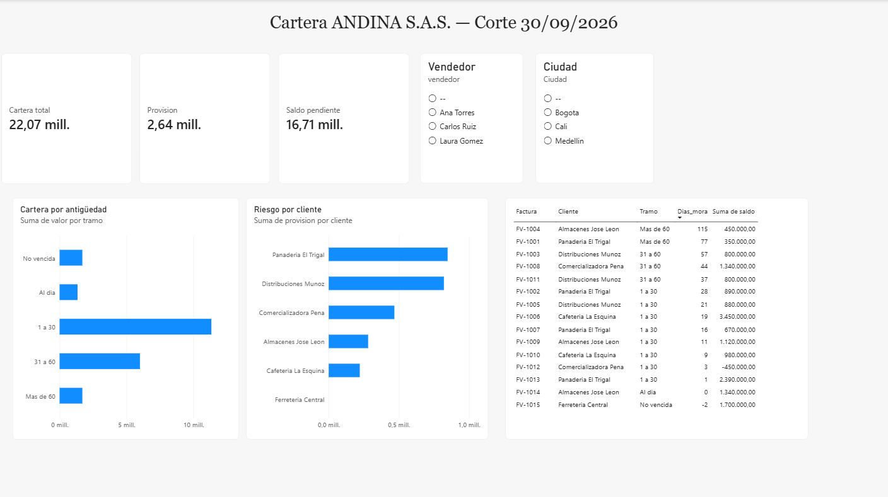

# Tablero de cartera en Power BI

Tablero interactivo de cuentas por cobrar conectado directamente a PostgreSQL, con filtrado cruzado por ciudad, vendedor y tramo de antigüedad.

---

## Problema

El [aging de cartera en SQL](../../02-sql/01-aging-cartera/) responde las preguntas correctas, pero exige que alguien escriba una consulta cada vez. Quien necesita el dato —cartera, cobranza, gerencia— no escribe SQL.

El encargo: convertir ese análisis en algo que otra persona pueda explorar sola.

## Enfoque

**Conectado a la base, no a un Excel exportado.** El tablero consume la vista `v_cartera_detalle` de PostgreSQL. Si cambian los datos o la política de provisión, se actualiza; no hay que rehacer nada.

**La lógica vive en SQL, no en Power Query.** Los JOIN, la asignación de tramos, el cálculo de provisión y las banderas de integridad están en la vista. Power BI solo consume el resultado.

Esa decisión importa: si la transformación estuviera dentro del archivo `.pbix`, solo serviría para este tablero. En la base, **cualquier herramienta que se conecte obtiene los mismos números** — Excel, otro reporte, o el siguiente analista.

**Estructura de arriba abajo:** indicadores y filtros, panorama en gráficos, detalle en tabla. Quien quiere el titular se queda arriba; quien necesita saber qué factura hay detrás, baja la vista.

## Qué muestra

| Zona | Contenido |
|---|---|
| Indicadores | Cartera total, provisión y saldo pendiente |
| Filtros | Vendedor y ciudad |
| Cartera por antigüedad | Distribución por tramo de mora |
| Riesgo por cliente | Clientes ordenados por provisión |
| Detalle | Facturas ordenadas de mayor a menor mora |

Todos los visuales se filtran entre sí: hacer clic en el tramo *Más de 60* muestra qué clientes y qué facturas lo componen.

## Decisiones de diseño

**Los tramos van en orden de antigüedad, no alfabético.** Power BI ordena las categorías alfabéticamente por defecto, lo que mezclaría "1 a 30" con "31 a 60" y pondría "Al día" en medio. La vista incluye una columna `orden_tramo` precisamente para esto.

**Se eliminó la fila de totales de la tabla de detalle.** Power BI suma automáticamente todas las columnas numéricas, incluidos los días de mora — un número sin significado: la antigüedad no es aditiva entre documentos. Que una herramienta pueda calcular algo no quiere decir que ese algo signifique algo.

**El filtro de ciudad muestra un valor en blanco**, y se dejó visible a propósito. Corresponde a una factura de un cliente que no está en el maestro comercial — el mismo hallazgo que detectan los controles de calidad del proyecto de SQL. **Un reporte que muestra sus propios huecos vale más que uno que los esconde.**

## Lectura

La cartera se concentra en el tramo de **1 a 30 días**: más de la mitad del total. Los extremos —no vencida y más de 60— son pequeños.

El ranking por provisión pone arriba a Panadería El Trigal, pero el indicador mira hacia atrás: mide deterioro ya ocurrido. **Distribuciones Muñoz es el caso donde una gestión esta semana cambia el próximo cierre**, porque tiene el grueso de su saldo en el tramo de 31 a 60, a un mes de pasar al 50% de provisión.

## Limitaciones

- **No está publicado en línea.** El servicio de Power BI requiere cuenta corporativa o educativa; el entregable es el archivo `.pbix` y las capturas.
- Un solo corte: sin histórico no hay evolución ni comparación contra el mes anterior.
- El tablero hereda las limitaciones del modelo de datos de origen, documentadas en el [proyecto de SQL](../../02-sql/01-aging-cartera/).

## Reproducir

1. Ejecutar los scripts del [proyecto de aging](../../02-sql/01-aging-cartera/) sobre una base PostgreSQL
2. Abrir `tablero-cartera.pbix` en Power BI Desktop
3. Actualizar credenciales de la conexión si es necesario: `localhost:5432`, base `andina`

## Herramientas

Power BI Desktop · conexión PostgreSQL en modo Importar · segmentaciones · filtrado cruzado · orden por columna
