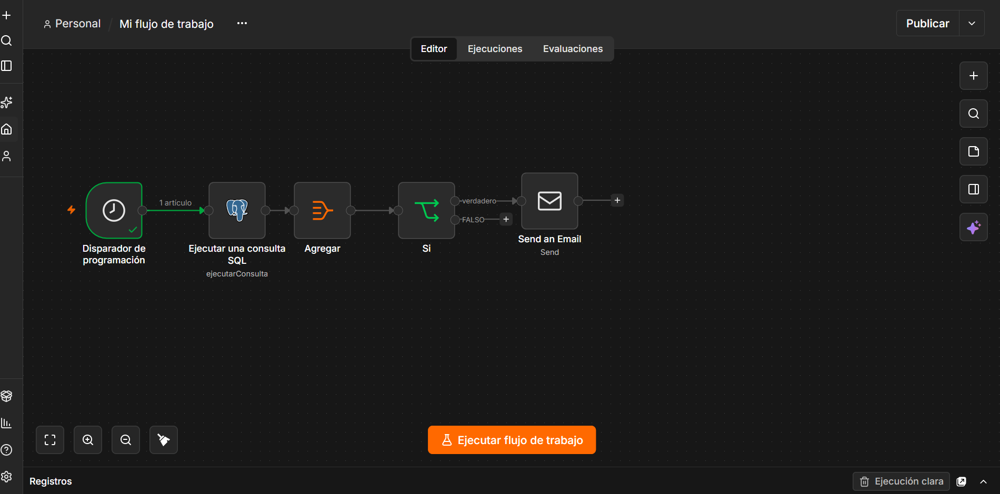
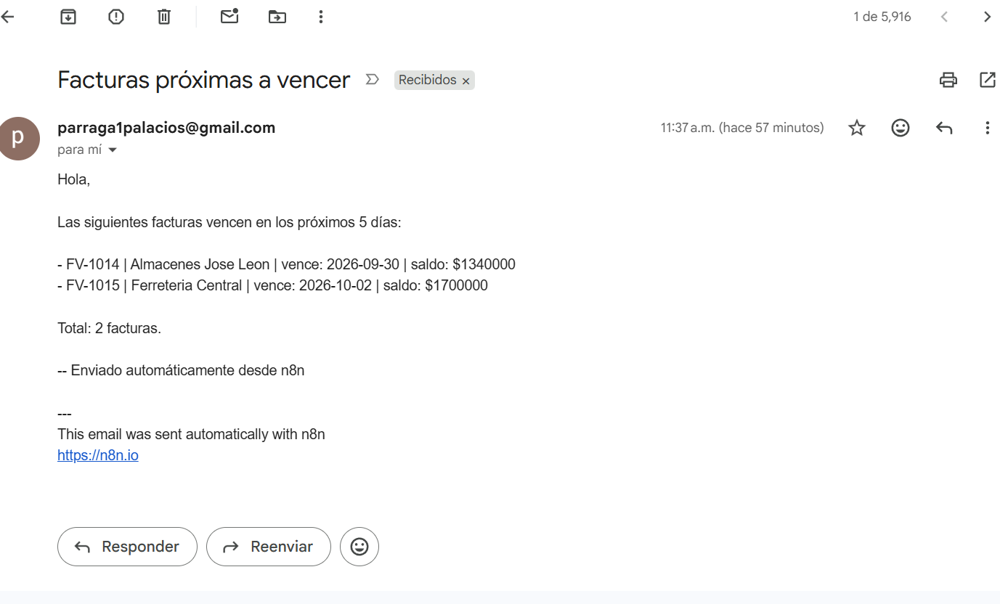
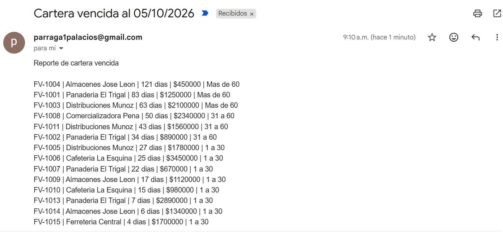
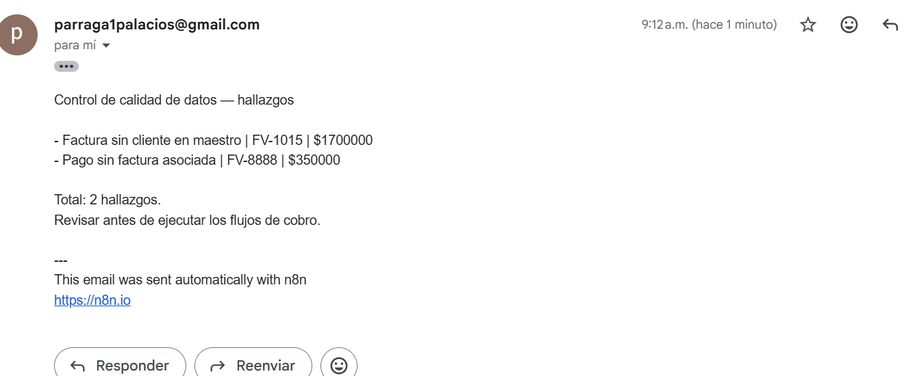

# Automatizaciones de cartera en n8n

Tres flujos que corren solos cada mañana sobre la base de cartera: uno avisa de los vencimientos próximos, otro reporta la mora, y un tercero audita la integridad de los datos antes de que los dos primeros escriban a nadie.



---

## Problema

El [aging de cartera](../../02-sql/01-aging-cartera/) y el [tablero](../../03-bi/01-tablero-cartera/) responden preguntas cuando alguien las hace. Pero el aviso de un vencimiento próximo **no funciona así**: si nadie entra a mirar, la factura vence igual.

Hay información que no sirve de nada esperando a que la consulten. Tiene que salir a buscar a quien la necesita.

## Los tres flujos

Todos comparten la misma arquitectura:

```
[Programación 8:00] → [Consulta SQL] → [Agregar] → [If] → [Correo]
```

| Nodo | Qué hace |
|---|---|
| **Schedule Trigger** | Dispara el flujo a diario, zona horaria `America/Bogota`. El control de calidad a las 7:30; los dos avisos a las 8:00 |
| **Postgres** | Ejecuta la consulta |
| **Aggregate** | Colapsa las filas en un solo elemento |
| **If** | Decide si hay algo que comunicar |
| **Send Email** | Envía el resumen por SMTP |

### 1 · Facturas próximas a vencer

```sql
SELECT factura, cliente, fecha_vencimiento,
       fecha_vencimiento - CURRENT_DATE AS dias_restantes,
       saldo
FROM v_cartera_detalle
WHERE fecha_vencimiento BETWEEN CURRENT_DATE AND CURRENT_DATE + 5
  AND saldo > 0
ORDER BY fecha_vencimiento;
```



### 2 · Aviso de mora

```sql
SELECT c.factura, c.cliente, c.fecha_vencimiento,
       CURRENT_DATE - c.fecha_vencimiento AS dias_mora,
       c.valor, r.tramo
FROM cartera c
JOIN rangos_mora r
    ON (CURRENT_DATE - c.fecha_vencimiento) BETWEEN r.dia_desde AND r.dia_hasta
WHERE c.fecha_vencimiento < CURRENT_DATE
  AND c.estado <> 'NOTA DE CREDITO'
ORDER BY dias_mora DESC;
```

El tramo no está escrito en la consulta: sale del `JOIN` contra `rangos_mora`. **Cambiar la política de cobranza es editar una fila de esa tabla, no reescribir el flujo.**



### 3 · Controles de calidad de datos

```sql
SELECT 'Factura sin cliente en maestro' AS control,
       c.factura AS documento, c.valor AS monto
FROM cartera c
LEFT JOIN clientes cl ON c.cliente = cl.nombre
WHERE cl.nombre IS NULL

UNION ALL

SELECT 'Pago sin factura asociada', p.factura, p.valor_pago
FROM pagos p
LEFT JOIN cartera c ON p.factura = c.factura
WHERE c.factura IS NULL;
```

Dos anti-joins unidos en un solo reporte. Detecta cada mañana los dos hallazgos documentados en el [proyecto de SQL](../../02-sql/01-aging-cartera/): `FV-1015` emitida a un cliente que no está en el maestro, y `FV-8888`, un pago contra una factura inexistente.



**Este flujo corre antes que los otros dos a propósito.** Un cobro enviado sobre un dato malo no es un error técnico: es un cliente molesto.

## Decisiones de diseño

**La fecha se calcula en cada ejecución, no se lee de una columna.** La versión inicial filtraba por `dias_mora`, una columna calculada una vez al cargar los datos. Funcionaba el primer día y mentía todos los demás.

> Una automatización que corre a diario no puede apoyarse en un número calculado una vez.

De ahí que las tres consultas usen `CURRENT_DATE`. Es la diferencia entre un reporte y un proceso.

**Un correo con el resumen, no uno por factura.** En n8n, cada fila que sale de un nodo hace que el siguiente se ejecute una vez. Una consulta de 50 facturas enviaría 50 correos. El `Aggregate` las colapsa en un solo elemento.

Por eso, antes de conectar cualquier nodo que haga algo irreversible —enviar, escribir, borrar—, hay que mirar **cuántos elementos** produce el nodo anterior. Es el equivalente de ejecutar un `SELECT` antes de un `DELETE`.

**Al cliente solo se le escribe si hay algo; al equipo interno siempre.** El criterio cambia según el destinatario:

> Un proceso automático que solo habla cuando tiene algo que decir es indistinguible de un proceso que dejó de funcionar.

Si cartera no recibe el correo un martes, no puede saber si es porque no había hallazgos o porque el flujo se rompió. Los flujos internos envían siempre, y **el asunto declara el número** — `Control de calidad — 0 hallazgos` es una afirmación; un cuerpo vacío no afirma nada.

**El destinatario es la propia cuenta.** Un flujo que escribe a terceros no se prueba con datos de prueba: se prueba contra uno mismo hasta que funciona, y solo entonces se cambia el destinatario.

## Credenciales

El envío usa **SMTP con una contraseña de aplicación de Google**, no la contraseña de la cuenta: una clave generada para esta aplicación concreta, revocable por separado y sin acceso al resto de la cuenta.

Lo correcto en producción sería **OAuth**, que autoriza a la aplicación sin entregarle ninguna contraseña. n8n lo soporta; exige crear un proyecto en Google Cloud.

Las credenciales se guardan cifradas en n8n y **no viajan en los archivos exportados**. Quien importe estos flujos deberá configurar las suyas.

## Limitaciones

- **Entregabilidad.** Los correos llegaron a la carpeta de spam durante las primeras pruebas. Una ejecución marcada en verde demuestra que el mensaje se entregó al servidor de correo, **no que alguien lo haya leído**. En producción se resuelve enviando desde un dominio corporativo con SPF y DKIM configurados.
- **El flujo solo se ejecuta mientras n8n esté corriendo.** En local, con el equipo encendido. En producción se despliega como servicio.
- **Destinatario fijo.** Escribir a cada cliente exigiría tener sus correos en el maestro y rediseñar el envío fila por fila.
- **Sin auditoría de envíos.** No queda registro de qué se notificó ni cuándo. El siguiente paso natural sería escribir cada envío en una tabla.

## Reproducir

1. Tener la base del [proyecto de aging](../../02-sql/01-aging-cartera/) cargada en PostgreSQL
2. Instalar n8n: `npx n8n`
3. Importar los `.json` desde el menú del editor
4. Configurar las credenciales: PostgreSQL y SMTP
5. Ajustar la zona horaria del disparador y publicar

## Herramientas

n8n · PostgreSQL · SMTP · expresiones JavaScript para el formato del mensaje
